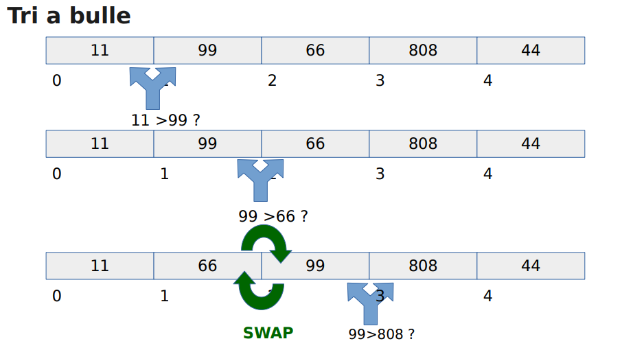

# Readme Benchme

# Enoncé

Le programme fait l'etude de 4 algorithmes de tri :

        Selection,   Insertion,    Bulle,   Tas

On pourra determiner lequel est le plus performant.

Les alogorithmes de tri :

        source : Cours tri

 

Pour cela :

- Chaque algorithme est testé 3 fois avec des tableaux différents.
- On ne garde que la valeur moyenne des trois tests.
- Vous devez trier des tableaux contenant des valeurs aléatoires comprises entre 0 et 106
- Vous devez réaliser les tests avec des tableaux contenants respectivement 100, 103, 104, 105, 106, 107 valeur

 

# Installation

Dans un terminal, telechargez le projet :

        git clone https://github.com/Maxxben/Benchme.git

Se rendre dans le repertoire Benchme :

        cd Benchme

## Windows

Dans un terminal taper la commande :

        minwg32-make

on genere ainsi un fichier Benchme.exe

 

## Linux

Dans un terminal taper la commande :

        make

On genere l'executable /exec/Benchme.exe

 

# Utilisation

Pour executer le porgramme :
    Dans un terminal
    
        ./exec/Benchme.exe {nom du fichier}

Donnez le nom du fichier sans l'extention pour creer un fichier CSV.

 

# Resultats

On etudie la performance des algorithmes de tri grace a leurs complexité algorithmique (rapport : temps de traitement / taille des tableaux triés) :

        

        source : https://www.mathweb.fr/euclide/complexite-algorithmique/

 

## Classification des algorithmes :

- Algorithme de tri lents :

        - Le tri Insertion      -       complexité : O(n^2)
        - Le tri Selection      -       complexité : O(n^2)
        - Le tri Bulle          -       complexité : O(n^2)

- Algorithme de tri rapide :

        - Le tri Tas            -       complexité : O(n!)

On voit bien que le tri par tas est beaucoup plus performant que les autres, sa complexité croit de maniere exponentiel. 